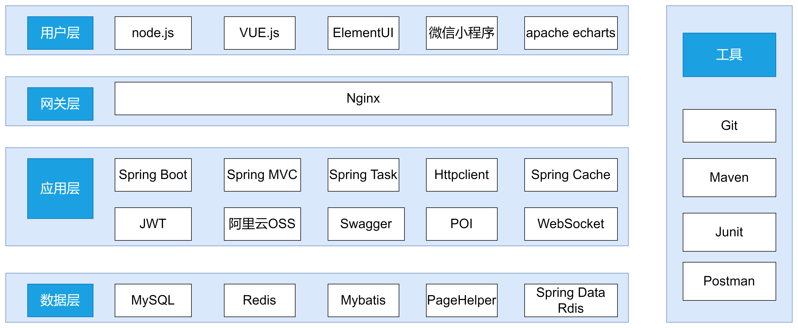
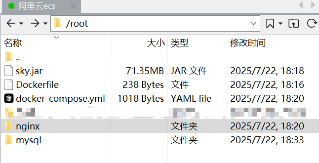

# sky-takeout

#### 介绍
黑马程序员苍穹外卖项目学习
#### 技术栈
前端：vue3 + Element UI   
后端：SSM + Spring Task + Spring Cache + Redis等  
技术选型图如下：


### docker部署教程

使用Dockerfile文件，采用`docker compose up -d`命令一键部署。

#### 拉取镜像
拉取nginx、mysql、redis、openjdk:8镜像

```aidl
pull nginx
pull mysql
pull redis
pull openjdk:tags # tags为自己的版本号，我这里为8
```
### 配置nginx容器启动需要的静态资源和配置文件

新建nginx文件夹，放入前端打包好的html文件夹和配置文件nginx.conf。 

html文件夹在上面代码中提供。

nginx.conf配置如下：

```

#user  nobody;
worker_processes  1;

#error_log  logs/error.log;
#error_log  logs/error.log  notice;
#error_log  logs/error.log  info;

#pid        logs/nginx.pid;


events {
    worker_connections  1024;
}


http {
    include       mime.types;
    default_type  application/octet-stream;

    #log_format  main  '$remote_addr - $remote_user [$time_local] "$request" '
    #                  '$status $body_bytes_sent "$http_referer" '
    #                  '"$http_user_agent" "$http_x_forwarded_for"';

    #access_log  logs/access.log  main;

    sendfile        on;
    #tcp_nopush     on;

    #keepalive_timeout  0;
    keepalive_timeout  65;

    #gzip  on;
	
	map $http_upgrade $connection_upgrade{
		default upgrade;
		'' close;
	}

	upstream webservers{ 
	  server sky:8080 weight=90 ; # 配置服务器ip地址，在docker中，可以使用容器名替代容器的ip地址，因此填写容器名sky
	  #server 127.0.0.1:8088 weight=10 ;
	}

    server {
        listen       80;

        #charset koi8-r;

        #access_log  logs/host.access.log  main;
		
		# 配置前端静态资源的路径，这里填写的是nginx容器内的默认路径。我们需要进行宿主机目录和容器内目录的映射，
		# 也就是挂载，这样在宿主机内就可以修改静态资源的文件，不用进入容器内操作文件
        location / {
            root /usr/share/nginx/html/sky;
        }

        #error_page  404              /404.html;

        # redirect server error pages to the static page /50x.html
        #
        error_page   500 502 503 504  /50x.html;
        location = /50x.html {
            root   html;
        }

        # 反向代理,处理管理端发送的请求
        location /api/ {
			proxy_pass   http://webservers/admin/;
            #proxy_pass   http://webservers/admin/;
        }
		
		# 反向代理,处理用户端发送的请求
        location /user/ {
            proxy_pass   http://webservers/user/;
        }
		
		# WebSocket，用来处理小程序端和管理端的通信
		location /ws/ {
            proxy_pass   http://webservers/ws/;
			proxy_http_version 1.1;
			proxy_read_timeout 3600s;
			proxy_set_header Upgrade $http_upgrade;
			proxy_set_header Connection "$connection_upgrade";
        }
    }

}
```

将nginx文件夹（包含html文件夹和nginx.conf文件）上传到服务器的root目录下。

### 配置mysql容器启动需要的文件

我们需要将宿主机目录挂载到容器内目录，需要挂载三个目录,以宿主机root目录为例：

- 挂载`/root/mysql/data`到容器内的`/var/lib/mysql`目录（存储数据库及其表结构和数据的目录）
- 挂载`/root/mysql/init`到容器内的`/docker-entrypoint-initdb.d`目录（初始化的SQL脚本目录）
- 挂载`/root/mysql/conf`到容器内的`/etc/mysql/conf.d`目录（这个是MySQL配置文件目录）

如果以上目录宿主机不存在，则会自动创建。

本项目下，在/root/mysql/init下提供一个sky_take_out_inti.sql脚本就够了。脚本文件在以上给出的代码中。

### redis容器没有额外需要配置的文件

### 配置我们sky项目（sky_take_out）的容器

这是自定义的容器，需要自己先创建镜像，再运行容器。

#### 制作sky镜像

制作镜像需要打包好的jar包和Dockerfile文件。

jar包自行打包即可。

Dokefile文件提供如下：

```
# 基础镜像
FROM openjdk:8  # 这里替换为自己的jdk版本号
# 设定时区
ENV TZ=Asia/Shanghai
RUN ln -snf /usr/share/zoneinfo/$TZ /etc/localtime && echo $TZ > /etc/timezone
# 拷贝jar包
COPY sky.jar /app.jar # sky.jar是自己打包好的jar包
# 入口
ENTRYPOINT ["java", "-jar", "/app.jar"]
```

将jar包和Dockefile文件上传到服务器root目录下，然后运行以下命令制作sky镜像。

```
docker build -t sky .
```

sky是镜像名字，后面的“.”是Dockerfile文件所在目录，我这里Dockerfile在当前目录下，所以使用了“.”

### 配置docker-compose.yaml文件

到这里为止，我们有了nginx,msyql,redis,sky的镜像，并且进行了必要的配置。下面就该通过yaml文件进行一键式的创建和运行所有的这些容器。

docker-compose.yaml文件如下：

```yaml
services:
  mysql:
    image: mysql
    container_name: mysql
    ports:
      - "3306:3306"
    environment:
      TZ: Asia/Shanghai
      MYSQL_ROOT_PASSWORD: 123 # 这里配置自己的mysql容器密码，必须和jar包中配置的mysql密码保持一致，不然项目会连接不上								   # mysql服务
    volumes:
      - "./mysql/conf:/etc/mysql/conf.d"
      - "./mysql/data:/var/lib/mysql"
      - "./mysql/init:/docker-entrypoint-initdb.d"
    networks: # docker自定义的网络，确保运行的容器都在同一个虚拟网卡的网络下面
      - sky-net
  redis:
    image: redis
    container_name: redis
    ports:
      - "6379:6379"
    volumes:
      - "./redis/data:/data"
    networks:
      - sky-net
  sky:
    image: sky
    container_name: sky
    ports:
      - "8080:8080"
    depends_on: # sky项目需要mysql服务，配置这项配置后，会先创建mysql容器，再创建sky容器，确保先后顺序
      - mysql
    networks:
      - sky-net
  nginx:
    image: nginx
    container_name: nginx
    ports:
      - "80:80"
    volumes:
      - "./nginx/nginx.conf:/etc/nginx/nginx.conf"
      - "./nginx/html:/usr/share/nginx/html"
    depends_on:
      - sky
    networks:
      - sky-net
networks: # 这里进行新建容器的网络
  sky-net:
    name: sky-net
```

也将docker-compose.yaml文件放到root目录下。

### 启动容器

到这里，所有的配置项都已经完成。这时，root目录下应该包含nginx文件夹，mysql文件夹，docker-compose.yaml文件，sky.jar包和Dockerfile文件。只需要用到nginx,mysql,docker-compose.yaml三个就够了。



运行

```
docker compose up -d
```

即可启动容器，完成部署。
